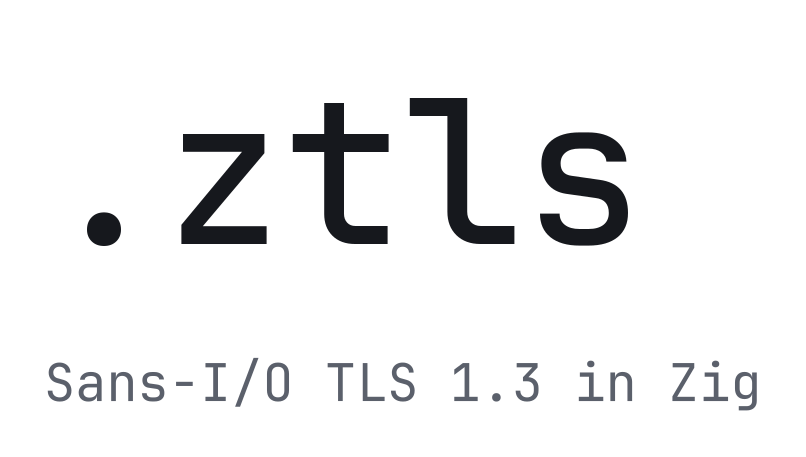

<p align="center">
  <picture>
    <source media="(prefers-color-scheme: dark)" srcset="images/logo/wordmark-dark.svg">
    
  </picture>
</p>

ztls is a TLS 1.3 library that does no I/O. You feed it the bytes you read off
the wire; it hands you back the bytes to write. Your socket, your event loop,
your buffers. ztls just does the protocol.

It's pre-alpha. The API will change out from under you. Read
[`docs/USAGE.md`](docs/USAGE.md) before you build on it.

## Why it works this way

Most TLS libraries own their sockets, which means they own your I/O model too —
blocking calls, or their async runtime, or their callback shape. ztls owns none
of that. It's a state machine: bytes in, bytes out. Drive it from blocking
reads, epoll, io_uring, or an in-memory pipe. The examples do all four.

The state machine also never calls an allocator. You hand it buffers, it uses
those buffers, and that's the whole memory story. Nothing hides on the heap. One
caveat, said plainly: the primitive crypto is delegated to a libcrypto backend
(OpenSSL today, AWS-LC next), and OpenSSL allocates during setup and inside its
own routines. We don't pretend otherwise. But ztls's own code — parsing,
framing, the transcript, record sequencing — allocates nothing.

Scope is deliberately narrow. TLS 1.3 only, on Linux and macOS. No 1.2 fallback
to get downgraded into, no DTLS, no Windows portability layer. That's less code
and a smaller thing to attack.

It's written in Zig, so there's no allocator in the hot path and no C in our own
source. AEAD, key exchange, and signatures come from libcrypto; ztls handles the
protocol wrapped around them.

## Performance

Speed is the reason ztls exists, so here's where it actually stands.

On the in-memory application-data benchmarks, ztls beats OpenSSL's libssl on
every suite and size we've measured. Against rustls it's a split decision. ztls
wins on AES-GCM. It loses on small ChaCha20-Poly1305 records, where rustls's
ring backend is simply faster than OpenSSL's EVP ChaCha path. That losing row is
in the repo too, with the disassembly that explains it.

Here's the AES-128-GCM ping-pong row at 1350-byte records, from the
`c7i.2xlarge` capture under
[`docs/research/perf/20260705-194022-ec2-c7i-2xlarge/`](docs/research/perf/20260705-194022-ec2-c7i-2xlarge/)
(git rev `89c869e`, Zig 0.15.2 ReleaseFast, native CPU, `--count 5`):

| impl | ns/op | vs ztls |
|---|---:|---:|
| ztls | 786 | — |
| rustls | 1384 | +76% |
| OpenSSL libssl | 1845 | +135% |

The perf counters back this up. On that row ztls burns fewer cycles,
instructions, and branches per op than either competitor
([`docs/research/perf/20260705-215953-ec2-c7i-2xlarge-row-perf/`](docs/research/perf/20260705-215953-ec2-c7i-2xlarge-row-perf/)),
so it isn't a wall-clock fluke.

Now the caveats, because honest and dishonest benchmarks part ways right here:

- Two x86_64 EC2 instances. That's not a hardware matrix, and there's no
  repetition or threshold policy yet. Treat these as measurements, not a
  marketing number.
- rustls's harness times batches; ztls's and libssl's time single iterations.
  The measurement shapes aren't identical.
  [`docs/research/PERFORMANCE.md`](docs/research/PERFORMANCE.md) has the
  row-by-row equivalence methodology.
- The full-handshake row isn't a fair fight. ztls verifies the server's
  CertificateVerify signature; the rustls and libssl harness peers don't. We
  report it on its own and never quote it as a head-to-head.

New results replace these as they land.

## Start here

Read [`docs/USAGE.md`](docs/USAGE.md) for the API guide. If you'd rather read
code, start with the examples that run in CI:

- [`examples/in_memory_handshake.zig`](examples/in_memory_handshake.zig) — both endpoints in one process, no sockets.
- [`examples/tcp_loopback.zig`](examples/tcp_loopback.zig) — client and server over `std.net.Stream` loopback.
- [`examples/epoll_pingpong.zig`](examples/epoll_pingpong.zig) — non-blocking Linux epoll ping-pong.
- [`examples/iouring_pingpong.zig`](examples/iouring_pingpong.zig) — Linux io_uring ping-pong.

Run them from the devshell:

```sh
nix develop .#openssl
just examples-ci
```

`nix develop .#aws-lc` selects the AWS-LC shell for backend work. OpenSSL is the
default devshell and the default `-Dcrypto-backend`.

## Supported surface

The supported path is server-authenticated TLS 1.3 1-RTT over caller-owned
buffers. ztls owns protocol state, record framing, encryption, transcript
hashing, alerts, and key updates. You own transport I/O, the buffers, and the
drive loop.

- TLS 1.3 only. TLS 1.2, DTLS, and Windows are out of scope.
- Cipher suites: `TLS_AES_128_GCM_SHA256`, `TLS_AES_256_GCM_SHA384`, and
  `TLS_CHACHA20_POLY1305_SHA256`.
- Examples use X25519. Server-side P-256 ECDHE exists for conformance work.
  Broader named-group and provider work is tracked by [#6](https://github.com/mattrobenolt/ztls/issues/6).
- Server certificate authentication works. Client certificate auth is tracked
  by [#4](https://github.com/mattrobenolt/ztls/issues/4).
- PSK/session resumption is [#2](https://github.com/mattrobenolt/ztls/issues/2),
  0-RTT is [#3](https://github.com/mattrobenolt/ztls/issues/3),
  HelloRetryRequest retry is [#1](https://github.com/mattrobenolt/ztls/issues/1).

## Fresh project

Use Zig 0.15.2 or newer. ztls links a libcrypto-family provider through
`pkg-config`; the devshell supplies OpenSSL by default.

```sh
mkdir hello-ztls
cd hello-ztls
zig init
```

Add ztls as a dependency. Fetching it pins the content hash for you:

```sh
zig fetch --save https://github.com/mattrobenolt/ztls/archive/main.tar.gz
```

That writes a `.ztls` entry into the generated `build.zig.zon` (keep the
fingerprint `zig init` generated):

```zig
.dependencies = .{
    .ztls = .{
        .url = "https://github.com/mattrobenolt/ztls/archive/main.tar.gz",
        .hash = "...", // filled in by `zig fetch --save`
    },
},
```

If you've checked out the ztls repo alongside your project, point at it
directly instead — the path is relative to your project root:

```zig
.ztls = .{ .path = "../ztls" },
```

Wire the module into your executable in `build.zig`:

```zig
const ztls_dep = b.dependency("ztls", .{
    .target = target,
    .optimize = optimize,
});

const exe_mod = b.createModule(.{
    .root_source_file = b.path("src/main.zig"),
    .target = target,
    .optimize = optimize,
    .imports = &.{.{ .name = "ztls", .module = ztls_dep.module("ztls") }},
});
const exe = b.addExecutable(.{ .name = "hello-ztls", .root_module = exe_mod });
```

Now `@import("ztls")` works from `src/main.zig`. The longer setup is in
[`docs/USAGE.md`](docs/USAGE.md).

## Project state

[`PRODUCTION_READINESS.md`](PRODUCTION_READINESS.md) tracks what's actually done
and what "done" means. This README tells you what ztls is; it doesn't make status
claims. Design notes, the threat model, and the performance evidence live under
[`docs/research/`](docs/research/).
