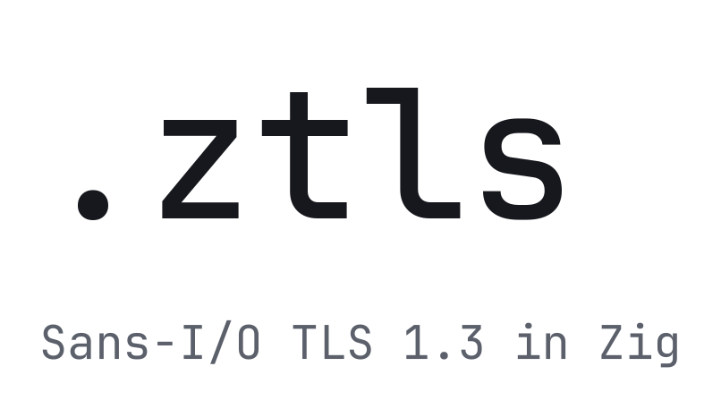

<p align="center">
  <picture>
    <source media="(prefers-color-scheme: dark)" srcset="images/logo/wordmark-dark.svg">
    
  </picture>
</p>

ztls is a TLS 1.3 library that does no I/O. You feed it the bytes you read off
the wire; it hands you back the bytes to write. Your socket, your event loop,
your buffers. ztls just does the protocol.

It's pre-alpha. The API will change out from under you. Read
[`docs/USAGE.md`](docs/USAGE.md) before you build on it.

## Performance

Speed is why ztls exists, so it goes first. The claim, stated plainly: ztls is
faster than OpenSSL's libssl on every comparable application-data row we measure,
on both x86_64 and aarch64. Against rustls it wins on AES-GCM everywhere and
loses on exactly one thing — small ChaCha20-Poly1305 records on x86_64 — which
is in the repo with the disassembly that explains it.

The evidence is two n=10 captures: a `c7i.2xlarge` (Intel Xeon, x86_64) and a
`c7g.2xlarge` (Graviton4, aarch64), OpenSSL 3.6.3, rustls 0.23.4x, Zig 0.15.2
ReleaseFast. Both produce formal confidence intervals (±0% to ±5% across rows)
and p=0.000 on every comparable row. The smallest ztls win over rustls on a
comparable AES-GCM row is +65%; the deltas are large enough that noise doesn't
change the answer.

Headline row — AES-128-GCM ping-pong at 1350-byte records, near the common MTU
boundary, from the x86_64 n=10 capture
([`docs/research/perf/20260712-102422-ec2-c7i-2xlarge/`](docs/research/perf/20260712-102422-ec2-c7i-2xlarge/)):

| impl | ns/op | vs ztls |
|---|---:|---:|
| ztls | 790.7 | — |
| rustls | 1447.5 | 1.83× slower |
| OpenSSL libssl | 1820.5 | 2.30× slower |

That isn't a wall-clock fluke. On this row ztls executes 42.7% of libssl's
cycles per op and 54.8% of rustls's, and the perf counters and hot symbols are
captured next to the timings. libssl spends the difference in `WPACKET` and
`tls13_cipher` wrapper work layered over the same OpenSSL primitive; rustls
spends it in `ChunkVecBuffer::write_to`, an AVX-512 memmove, and malloc. ztls's
caller-owned record path reaches the AEAD primitive with less standing between
it and the bytes.

Now the honest parts, because that's the whole brand:

- **The one loss.** On x86_64, ztls is slower than rustls on small ChaCha20
  records (16B and 128B: -50% to -56%). rustls's ring ChaCha20 path is cheaper
  for tiny records than OpenSSL's EVP ChaCha path — the ztls samples sit in
  OpenSSL's ChaCha symbols, not in ztls framing, so it's a backend-primitive
  gap, not a record-path one. On aarch64 it mostly disappears: a tie at 16B,
  rustls ~20% ahead at 128B, ztls winning from 1350B up.
- **Measurement shapes differ.** rustls's harness times batches; ztls's and
  libssl's time single iterations. The row-by-row equivalence accounting is in
  [`docs/research/PERFORMANCE.md`](docs/research/PERFORMANCE.md).
- **Handshake is not a head-to-head.** ztls verifies the server's
  CertificateVerify signature; rustls's harness uses a `NoVerifier` that skips
  it, and libssl's behavior without a trust store is opaque. That row is
  reported on its own and never quoted as a comparison.

Three platforms is not the whole hardware world — AMD and older Graviton
aren't measured yet — but the core claim (faster than libssl and rustls on
AES-GCM app data across x86_64, aarch64, and macOS Apple Silicon) holds with
formal CIs. Full row tables, methodology, and the mechanism writeups are in
[`docs/research/PERFORMANCE.md`](docs/research/PERFORMANCE.md); a 15% regression
gate on comparable AES-GCM rows runs against the committed n=10 baseline. New
results replace these as they land.

## Why it works this way

Most TLS libraries own their sockets, which means they own your I/O model too —
blocking calls, or their async runtime, or their callback shape. ztls owns none
of that. It's a state machine: bytes in, bytes out. Drive it from blocking
reads, epoll, io_uring, or an in-memory pipe. The examples do all four.

The state machine also never calls an allocator. You hand it buffers, it uses
those buffers, and that's the whole memory story. Nothing hides on the heap. One
caveat, said plainly: the primitive crypto is delegated to a libcrypto backend
— OpenSSL, AWS-LC, or BoringSSL, all three live and CI-gated — and those
backends allocate during setup and inside their own routines. We don't pretend
otherwise. But ztls's own code — parsing, framing, the transcript, record
sequencing — allocates nothing.

Scope is deliberately narrow. TLS 1.3 only, on Linux and macOS. No 1.2 fallback
to get downgraded into, no DTLS, no Windows portability layer. That's less code
and a smaller thing to attack.

It's written in Zig, so there's no allocator in the hot path and no C in our own
source. AEAD, X25519/P-256 ECDHE, and CertificateVerify sign/verify come from the
libcrypto backend; the key schedule (HKDF/HMAC/SHA transcript hash) and Ed25519
certificate-chain signature verification stay on `std.crypto`. ztls handles the
protocol wrapped around all of it.

## Start here

Read [`docs/USAGE.md`](docs/USAGE.md) for the API guide. If you'd rather read
code, start with the examples that run in CI:

- [`examples/in_memory_handshake.zig`](examples/in_memory_handshake.zig) — both endpoints in one process, no sockets.
- [`examples/tcp_loopback.zig`](examples/tcp_loopback.zig) — client and server over `std.net.Stream` loopback.
- [`examples/epoll_pingpong.zig`](examples/epoll_pingpong.zig) — non-blocking Linux epoll ping-pong.
- [`examples/iouring_pingpong.zig`](examples/iouring_pingpong.zig) — Linux io_uring ping-pong.
- [`integrations/ztls-ktls/examples/ktls_pingpong.zig`](integrations/ztls-ktls/examples/ktls_pingpong.zig) — Zig 0.16/Linux kTLS: exact handoff, kernel data plane, live KeyUpdate, and explicit close alerts.

Run them from the devshell:

```sh
nix develop .#openssl
just examples-ci
nix develop .#ztls-ktls --command just integrations/ztls-ktls/ci
```

`nix develop .#aws-lc` selects the AWS-LC shell for backend work. OpenSSL is the
default devshell and the default `-Dcrypto-backend`.

## Supported surface

ztls owns protocol state, record framing, encryption, transcript hashing,
alerts, and key updates over caller-owned buffers. You own transport I/O, the
buffers, and the drive loop. Both client and server roles are implemented.

**Supported** means it's exercised in CI. **Partial** means the code exists and
passes local tests but isn't validated against an external conformance peer yet.
**Out of scope** means it isn't coming — a scope decision, not a gap.

| Feature | Status | Notes |
|---|---|---|
| TLS 1.3 handshake, 1-RTT | Supported | Client and server roles |
| TLS 1.2 fallback | Out of scope | No downgrade target, by design |
| DTLS | Out of scope | |
| Cipher suites | Supported | AES-128-GCM, AES-256-GCM, ChaCha20-Poly1305 |
| Key exchange: X25519, P-256 | Supported | ECDHE |
| Key exchange: P-384 | Supported | Opt-in; bidirectional OpenSSL 3.6 interop on every non-FIPS backend |
| Post-quantum: RFC 10024 hybrid groups | Supported | X25519MLKEM768, SecP256r1MLKEM768, and SecP384r1MLKEM1024; opt-in, OpenSSL-interoperable, upstream tlsfuzzer matrix |
| Server certificate auth | Supported | Hostname verification, chain validation, leaf policy |
| Client certificate auth | Supported | Both roles, EKU/KU enforcement, OpenSSL interop |
| Session resumption (PSK) | Supported | NewSessionTicket + PSK ClientHello; OpenSSL interop gated |
| 0-RTT early data | Supported | Offer/accept/reject; caller owns replay-safety policy |
| HelloRetryRequest | Supported | Both roles; forced-HRR OpenSSL interop not gated |
| KeyUpdate | Supported | Both directions, both roles |
| Application data, alerts, `close_notify` | Supported | |
| kTLS offload | Supported | Linux only; key export + kernel data plane |
| Windows | Out of scope | Linux and macOS only |

Crypto primitives come from a libcrypto backend, selected at build time:

| Backend | Status |
|---|---|
| OpenSSL | Supported (default) |
| AWS-LC | Supported (`-Dcrypto-backend=aws-lc`) |
| BoringSSL | Supported (`-Dcrypto-backend=boringssl`) |

All three RFC 10024 groups use provider-backed pure ML-KEM with ztls-owned
hybrid composition on OpenSSL, AWS-LC, and BoringSSL. The FIPS backend
identities do not advertise them. A BoGo conformance runner is deferred, and
FIPS mode has compile-time capability tables but no runtime FIPS-provider
verification.

## Fresh project

Use Zig 0.15.2 or newer. ztls links a libcrypto-family provider through
`pkg-config`; the devshell supplies OpenSSL by default.

```sh
mkdir hello-ztls
cd hello-ztls
zig init
```

Add ztls as a dependency. Fetching it pins the content hash for you:

```sh
zig fetch --save https://github.com/mattrobenolt/ztls/archive/main.tar.gz
```

That writes a `.ztls` entry into the generated `build.zig.zon` (keep the
fingerprint `zig init` generated):

```zig
.dependencies = .{
    .ztls = .{
        .url = "https://github.com/mattrobenolt/ztls/archive/main.tar.gz",
        .hash = "...", // filled in by `zig fetch --save`
    },
},
```

If you've checked out the ztls repo alongside your project, point at it
directly instead — the path is relative to your project root:

```zig
.ztls = .{ .path = "../ztls" },
```

Wire the module into your executable in `build.zig`:

```zig
const ztls_dep = b.dependency("ztls", .{
    .target = target,
    .optimize = optimize,
});

const exe_mod = b.createModule(.{
    .root_source_file = b.path("src/main.zig"),
    .target = target,
    .optimize = optimize,
    .imports = &.{.{ .name = "ztls", .module = ztls_dep.module("ztls") }},
});
const exe = b.addExecutable(.{ .name = "hello-ztls", .root_module = exe_mod });
```

Now `@import("ztls")` works from `src/main.zig`. The same fetched dependency
exposes the Zig 0.16 integration modules:

| Module | Purpose | Extra requirement |
|---|---|---|
| `ztls_std` | Blocking `std.Io.net` stream wrapper | Zig 0.16 |
| `ztls_xev` | Non-blocking libxev adapter | Zig 0.16 and `.xev = true` in the `b.dependency` options |
| `ztls_ktls` | Linux kernel TLS data plane | Zig 0.16 and Linux |

Core `ztls` remains compatible with Zig 0.15.2. Importing an integration with
Zig 0.15 reports the version requirement directly. `ztls_xev` is opt-in so a
core or `ztls_std` consumer does not fetch libxev. The exact wiring is in
[`docs/USAGE.md`](docs/USAGE.md).

## Project state

[`PRODUCTION_READINESS.md`](PRODUCTION_READINESS.md) is the single source of truth
for what's actually done and what "done" means. This README tells you what ztls
is and surfaces the supported-surface table above, but the spine is the
authority behind every status claim in it. Design notes, the threat model, and
the performance evidence live under [`docs/research/`](docs/research/).

ztls is pre-alpha. The API will move. An internal adversarial security review
(Project Glasswing: recon → hunt → validate) found three vulnerabilities — all
fixed with regression tests. It is not an external audit. Read
[`SECURITY.md`](SECURITY.md) for the full posture and
[`docs/research/security/FINDINGS.md`](docs/research/security/FINDINGS.md) for
the evidence. Do not put it in front of real traffic yet.

### Roadmap to v0.1.0

There is no release tag, and that's on purpose. `main` is the only artifact
today — when the README tells you to `zig fetch` from `main`, that's not a
placeholder for a version you should be waiting for; it's the whole distribution.
There is no stable tag yet because two things have to land before a first tagged
release means anything:

- **A frozen public API.** Right now signatures, type names, and module layout
  change whenever the design gets better. A `v0.1.0` is a promise not to do that
  casually, and that promise can't exist until the surface is committed and
  frozen. Until then, pinning a tag would be pinning a lie.
- **A C ABI ([#30](https://github.com/mattrobenolt/ztls/issues/30)).** ztls is
  Zig-only today, so the entire addressable audience is Zig callers. A
  C-callable surface is what makes non-Zig callers exist at all. A first release
  without it would ship to almost nobody.

The RFC 10024 hybrid groups landed without becoming a release gate. Future
named groups can do the same: they should follow provider capability and real
interop evidence, not hold `v0.1.0` hostage. The changelog
([`CHANGELOG.md`](CHANGELOG.md)) tracks what's on `main` in the meantime.
Depend on `main` if you want; just know the ground moves.
